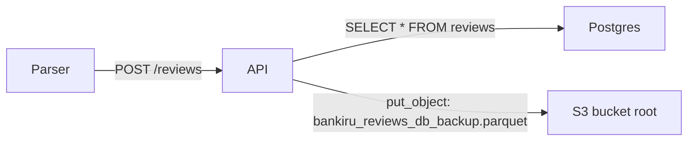

# Plan: Refactor Backup Logic to Daily Batch Parquet Files

## Problem Statement

The current backup logic in `bankiru-reviews` backs up the **entire database table** as a single `bankiru_reviews_db_backup.parquet` file to the **root** of the `oait-bucket` S3 bucket after every write operation (POST, DELETE, dedup). As the table grows (~370K+ rows), this becomes increasingly slow and wasteful.

The new behavior should:
1. Back up only the **daily collected batch** (the reviews just POSTed by the parser)
2. Name the file `bankiru-reviews-YYYY-MM-DD.parquet`
3. Write to the `bankiru-reviews/` subfolder within the same bucket
4. Remove backup triggers from DELETE endpoints (only POST creates backups)

## Current Architecture



**Current flow in [`routes.py`](../src/bankiru/api/routes.py):**
1. `post_reviews` → bulk INSERT → calls `get_reviews(backup_request)` which SELECTs the **entire table**, serializes to Parquet, uploads to S3
2. `delete_reviews` → DELETE by ID → same full-table backup
3. `delete_reviews_by_date` → DELETE by date range → same full-table backup (if rows deleted)
4. `delete_duplicate_reviews` → CTE dedup → same full-table backup (if rows deleted)

**Key files involved:**
- [`routes.py:28`](../src/bankiru/api/routes.py:28) — `backup_request = Request(isBackup=True)` sentinel
- [`routes.py:58-59`](../src/bankiru/api/routes.py:58) — backup trigger in `post_reviews`
- [`routes.py:131-132`](../src/bankiru/api/routes.py:131) — backup trigger in `delete_reviews`
- [`routes.py:163-164`](../src/bankiru/api/routes.py:163) — backup trigger in `delete_reviews_by_date`
- [`routes.py:207-208`](../src/bankiru/api/routes.py:207) — backup trigger in `delete_duplicate_reviews`
- [`handlers.py:67-70`](../src/bankiru/api/handlers.py:67) — S3 key generation (`bankiru_reviews_db_backup.parquet` at bucket root)
- [`handlers.py:76-86`](../src/bankiru/api/handlers.py:76) — `upload_contents()` puts object to bucket
- [`schemas.py:50`](../src/bankiru/api/schemas.py:50) — `isBackup` field on `Request`
- [`config.py`](../src/bankiru/config.py) — no backup-specific config currently

## Target Architecture


## Implementation Steps

### 1. Add `OBS_BACKUP_PREFIX` to config

**File:** [`config.py`](../src/bankiru/config.py)

Add a new optional setting in the Object storage section (after `OBS_ENDPOINT`):
```python
OBS_BACKUP_PREFIX: str = "bankiru-reviews"
```

This controls the S3 "folder" prefix. Default `bankiru-reviews` means files land at `bankiru-reviews/bankiru-reviews-YYYY-MM-DD.parquet`.

**File:** [`.env.example`](../.env.example)

Add under the Object storage section:
```
# S3 subfolder for daily Parquet backups (default: bankiru-reviews)
OBS_BACKUP_PREFIX=bankiru-reviews
```

### 2. Create a dedicated `_backup_daily_batch` function in `routes.py`

**File:** [`routes.py`](../src/bankiru/api/routes.py)

Add `import asyncio`, `import io`, and `import pandas as pd` to the imports.

Replace the current backup logic (which re-queries the entire table via `get_reviews(backup_request)`) with a new lightweight function that:

1. Accepts the already-dumped `rows` list (the same `list[dict]` used for the INSERT — avoids calling `model_dump()` twice)
2. Determines the backup date from the reviews' `datePublished` field (use the most common date, or today's date as fallback)
3. Serializes the batch to Parquet in-memory using pandas + pyarrow (offloaded to a thread via `asyncio.to_thread` since Parquet serialization is CPU-bound)
4. Uploads to S3 at key `{OBS_BACKUP_PREFIX}/bankiru-reviews-{YYYY-MM-DD}.parquet`

```python
async def _backup_daily_batch(
    rows: list[dict],
    client: AioBaseClient,
) -> None:
    """Serialize the POSTed batch to Parquet and upload to S3."""
    settings = get_settings()

    def _serialize() -> tuple[io.BytesIO, str]:
        df = pd.DataFrame.from_records(rows)
        # datePublished is already a datetime (validated by Pydantic);
        # extract the date and pick the most common one for the filename.
        dates = pd.to_datetime(df["datePublished"]).dt.date
        backup_date = dates.mode().iloc[0] if not dates.empty else date.today()
        buf = io.BytesIO()
        df.to_parquet(buf, index=False)
        buf.seek(0)
        return buf, backup_date.isoformat()

    buf, date_str = await asyncio.to_thread(_serialize)

    key = f"{settings.OBS_BACKUP_PREFIX}/bankiru-reviews-{date_str}.parquet"
    await client.put_object(
        Bucket=settings.OBS_BUCKET,
        Key=key,
        Body=buf,
        ContentType="application/vnd.apache.parquet",
    )
```

**Why `rows` (list of dicts) instead of `list[schemas.Review]`:** The `post_reviews` function already calls `r.model_dump()` for the bulk INSERT. Passing the same `rows` list avoids serializing the Pydantic models a second time.

### 3. Update `post_reviews` in `routes.py`

**File:** [`routes.py`](../src/bankiru/api/routes.py)

Change the backup call from:
```python
with logfire.span("Make a database backup"):
    await get_reviews(backup_request, session, client)
```
to:
```python
with logfire.span("Backup daily batch to S3"):
    await _backup_daily_batch(rows, client)
```

Note: `rows` is the `list[dict]` already created earlier in the same function for the bulk INSERT — no extra DB query or serialization needed.

### 4. Remove backup triggers from DELETE endpoints

**File:** [`routes.py`](../src/bankiru/api/routes.py)

Remove the backup blocks from:
- `delete_reviews` (lines 131-132)
- `delete_reviews_by_date` (lines 163-164)
- `delete_duplicate_reviews` (lines 207-208)

DELETE operations no longer trigger backups. The daily backup is only created when the parser POSTs new reviews.

### 5. Remove `backup_request` sentinel and clean up `isBackup`

**File:** [`routes.py`](../src/bankiru/api/routes.py)
- Remove `backup_request = Request(isBackup=True)` (line 28)
- Remove the `if r.isBackup:` early-return branch in `get_reviews` (lines 101-102)

**File:** [`schemas.py`](../src/bankiru/api/schemas.py)
- Remove `isBackup: Annotated[bool, Field(exclude=True)] = False` from `Request` (line 50)
- The `Annotated` import can stay (it's used by other fields via `Field`)

**File:** [`handlers.py`](../src/bankiru/api/handlers.py)
- Remove `is_backup` parameter from `ScalarsHandler.__init__` (line 41)
- Remove `self.is_backup = is_backup` (line 52)
- Simplify the `key` property — always use UUID (lines 67-70):
  ```python
  @cached_property
  def key(self) -> str:
      return f"{uuid4()}.{self.extension}"
  ```
- Update the handler instantiation in `get_reviews` (line 98) to remove the `r.isBackup` argument:
  ```python
  # Before:
  handler = handler_class(scalars, client, r.isBackup)
  # After:
  handler = handler_class(scalars, client)
  ```

### 6. Update README.md

**File:** [`README.md`](../README.md)

#### English sections to update:

1. **Stack overview table** — Change the `api` row description from "Every write also triggers an automatic full-table Parquet backup to S3" to "Every parser POST triggers a daily Parquet backup of the collected batch to S3 under `bankiru-reviews/`"

2. **API reference → POST /reviews** — Update the description: "Inserts all rows, commits, then uploads the batch as a daily Parquet backup (`bankiru-reviews/bankiru-reviews-YYYY-MM-DD.parquet`) to S3."

3. **API reference → DELETE /reviews** — Remove "then triggers an automatic Parquet backup"
4. **API reference → DELETE /reviews/by-date** — Remove "then triggers an automatic Parquet backup (if any rows were deleted)"
5. **API reference → DELETE /reviews/duplicates** — Remove "If any rows were deleted, triggers an automatic Parquet backup"

6. **Output format handlers → Backup key** — Change from "`bankiru_reviews_db_backup.<extension>` (always Parquet)" to "`bankiru-reviews/bankiru-reviews-YYYY-MM-DD.parquet` (daily batch)"

7. **Stack overview table → External: S3 / OBS** — Change "the rolling Parquet backup (`bankiru_reviews_db_backup.parquet`)" to "daily Parquet backups (`bankiru-reviews/bankiru-reviews-YYYY-MM-DD.parquet`)"

8. **Configuration reference** — Add `OBS_BACKUP_PREFIX` to the optional settings table:

   | Variable | Default | Description |
   |----------|---------|-------------|
   | `OBS_BACKUP_PREFIX` | `bankiru-reviews` | S3 key prefix (subfolder) for daily Parquet backups. |

9. **Day-2 operations** — Update the S3 backup comment from "rewrites the full table as bankiru_reviews_db_backup.parquet in the OBS bucket" to "uploads the daily batch as bankiru-reviews/bankiru-reviews-YYYY-MM-DD.parquet in the OBS bucket"

#### Russian section to update:

- Update the bullet about backups: change "автоматически перезаписывает резервную копию всей базы (`bankiru_reviews_db_backup.parquet`) в объектном хранилище" to "автоматически сохраняет ежедневную резервную копию собранного пакета (`bankiru-reviews/bankiru-reviews-YYYY-MM-DD.parquet`) в объектном хранилище"
- Update the bullet about API endpoints: remove mention of automatic backup after DELETE operations

## Environment Variable Changes

| Variable | Action | Default | Purpose |
|----------|--------|---------|---------|
| `OBS_BACKUP_PREFIX` | **ADD** | `bankiru-reviews` | S3 key prefix (subfolder) for daily Parquet backups |

No existing variables need to be modified or removed.

**Operational note:** The new `OBS_BACKUP_PREFIX` variable should also be added to the Infisical secret store for the production environment (or it can be omitted to use the default `bankiru-reviews`).

## File Change Summary

| File | Change |
|------|--------|
| [`config.py`](../src/bankiru/config.py) | Add `OBS_BACKUP_PREFIX` setting |
| [`routes.py`](../src/bankiru/api/routes.py) | Add `import asyncio, io, pandas`; add `_backup_daily_batch()`; update `post_reviews`; remove backup from DELETEs; remove `backup_request`; remove `isBackup` branch from `get_reviews` |
| [`handlers.py`](../src/bankiru/api/handlers.py) | Remove `is_backup` param from `__init__`; simplify `key` to always use UUID |
| [`schemas.py`](../src/bankiru/api/schemas.py) | Remove `isBackup` field from `Request` |
| [`.env.example`](../.env.example) | Add `OBS_BACKUP_PREFIX` |
| [`README.md`](../README.md) | Update English + Russian sections |
