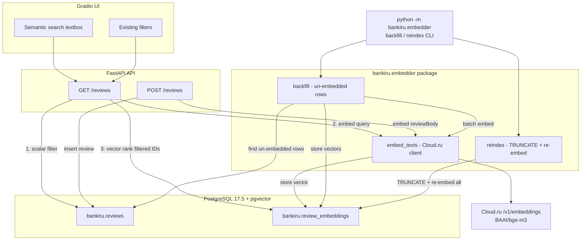
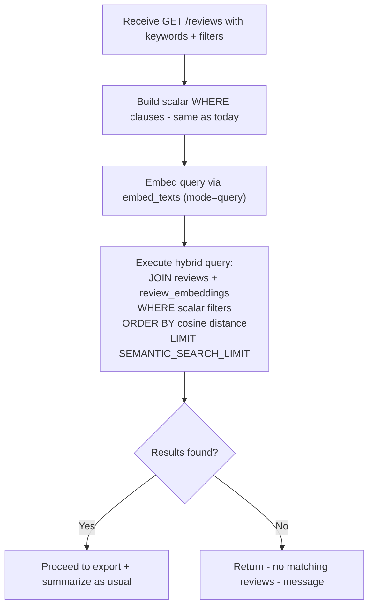
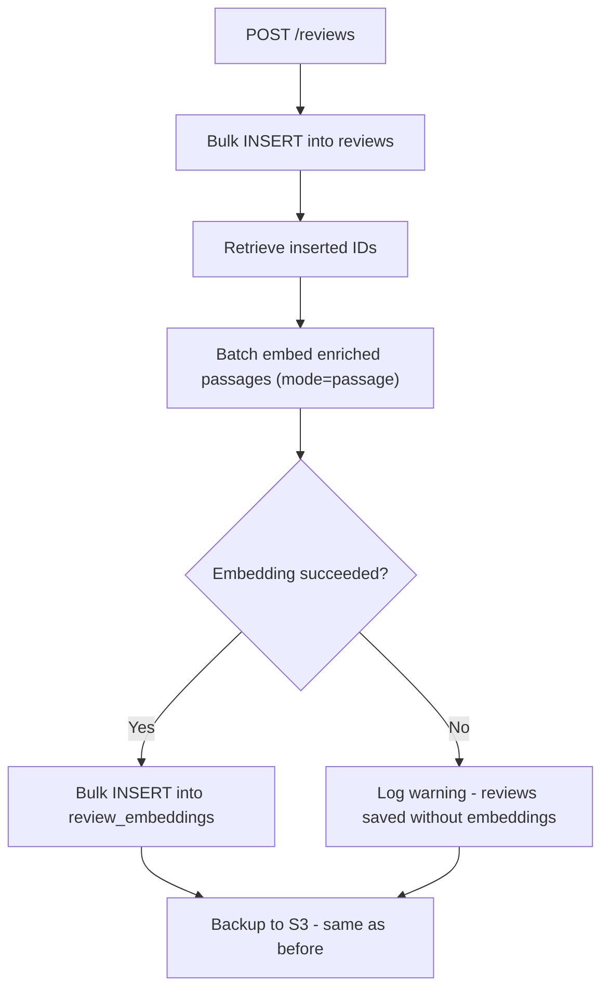
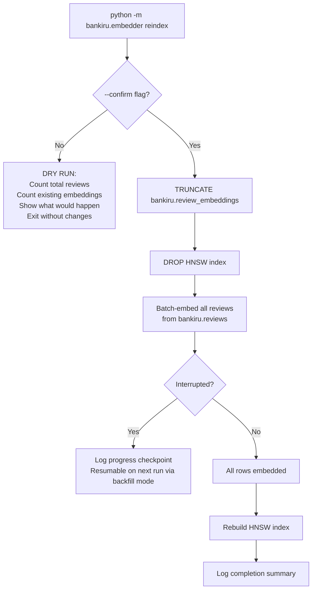

# Semantic Search Feature — Implementation Plan

## 1. Context & Decisions

| Decision | Choice | Rationale |
|----------|--------|-----------|
| Vector storage | **pgvector** (`vector 0.8.0`) on existing Cloud.ru RDS PostgreSQL 17.5 | Already available as an RDS plugin; no new infrastructure; same pattern as `app-store/pgvector` |
| Embedding model | **BAAI/bge-m3** (1024-dim, multilingual) via Cloud.ru Foundation Models `/v1/embeddings` | Best-in-class Russian multilingual encoder on Cloud.ru; proven in `app-store/wiki-mcp` |
| Search strategy | **Hybrid: scalar filters first, then vector rank** | Existing filters narrow the candidate set; cosine distance ranks within it |
| Embedding trigger | **Inline at `POST /reviews`** + **automatic background backfill at API startup** | New reviews are immediately searchable; 380K existing reviews are backfilled on first deploy |
| Index type | **HNSW** (`vector_cosine_ops`) | Best recall/latency trade-off for 380K × 1024-dim; supported by `vector 0.8.0` |
| Git branch | `semantic-search` | All work in a dedicated branch |

---

## 2. Architecture Overview



---

## 3. FOSS Vector Database Candidates

Although we chose **pgvector**, here is the evaluation of alternatives:

| Candidate | Key Strengths | Trade-offs | Suitability |
|-----------|--------------|------------|-------------|
| **pgvector** — chosen | Zero new infra — runs inside existing Postgres; HNSW + IVFFlat; SQL joins with scalar columns; ACID transactions | Single-node only; no built-in sharding; index build is memory-intensive | **Excellent** — 380K vectors fit comfortably; hybrid filter+rank via SQL JOINs is natural |
| **Qdrant** | Purpose-built for vectors; rich filtering; gRPC + REST; Rust performance | New service to deploy and maintain; data duplication — reviews in PG + vectors in Qdrant | Good for >10M vectors; overkill here |
| **Milvus** | Distributed; GPU-accelerated; massive scale | Heavy operational footprint — etcd, MinIO, Pulsar; complex for a small team | Over-engineered for this scale |
| **Chroma** | Simple Python API; embedded mode; good for prototyping | Not production-hardened; no SQL joins; limited filtering | Suitable for prototyping only |
| **Weaviate** | GraphQL API; hybrid search built-in; multi-modal | New service; Java-heavy; memory-hungry | Good alternative but adds operational complexity |

**Verdict:** pgvector is the clear winner — it leverages the existing Postgres instance, enables hybrid scalar+vector queries in a single SQL statement, and handles 380K × 1024-dim vectors with ease.

---

## 4. Database Changes

### 4.1 Enable pgvector extension

Via RDS console or SQL (requires `rds_superuser` or equivalent):

```sql
CREATE EXTENSION IF NOT EXISTS vector;
```

Per Cloud.ru RDS docs, this may need to be enabled via the RDS console plugin management page first.

### 4.2 New table: `bankiru.review_embeddings`

```sql
CREATE TABLE bankiru.review_embeddings (
    review_id  INTEGER PRIMARY KEY
               REFERENCES bankiru.reviews(id) ON DELETE CASCADE,
    embedding  vector(1024) NOT NULL
);
```

### 4.3 HNSW index

```sql
CREATE INDEX IF NOT EXISTS ix_review_embeddings_hnsw
    ON bankiru.review_embeddings
    USING hnsw (embedding vector_cosine_ops)
    WITH (m = 16, ef_construction = 200);
```

Parameters: `m=16` and `ef_construction=200` are good defaults for 380K vectors with 1024 dimensions. The index build will consume ~2–4 GB of `maintenance_work_mem`; set it temporarily during the backfill.

**Note:** SQLAlchemy's `create_all()` does not natively handle HNSW indexes. The HNSW index must be created via explicit `text()` DDL in `create_all_tables()`, similar to how the existing B-tree indexes are ensured with `CREATE INDEX IF NOT EXISTS`.

### 4.4 SQLAlchemy model

Add `ReviewEmbedding` to `src/bankiru/models.py` alongside the existing `Review`:

```python
from pgvector.sqlalchemy import Vector

class ReviewEmbedding(Base):
    __tablename__ = "review_embeddings"

    review_id: Mapped[int] = mapped_column(
        Integer,
        ForeignKey("reviews.id", ondelete="CASCADE"),
        primary_key=True,
    )
    embedding: Mapped[list[float]] = mapped_column(
        Vector(1024), nullable=False,
    )
```

---

## 5. Embedder Package

New package: **`src/bankiru/embedder/`**

This package contains all embedding-related logic — the Cloud.ru API client, backfill, and reindex. Both the API service (routes, lifespan) and the CLI entry point import from here, avoiding circular dependencies.

### 5.1 Core function: `embed_texts()`

Located in `src/bankiru/embedder/__init__.py`. Adapts the pattern from `app-store/wiki-mcp/main.py` `_embed()`:

```python
async def embed_texts(texts: list[str]) -> list[list[float]]:
    """Call Cloud.ru /v1/embeddings with a batch of texts.

    The API accepts multiple texts per request. For larger batches,
    chunk into sub-batches of EMBEDDINGS_BATCH_SIZE and call
    sequentially to respect rate limits.
    """
    s = get_settings()
    api_key = s.EMBEDDINGS_API_KEY or s.OPENAI_API_KEY
    base_url = s.EMBEDDINGS_BASE_URL or s.OPENAI_BASE_URL
    url = base_url.rstrip("/") + "/embeddings"
    headers = {
        "Authorization": f"Bearer {api_key}",
        "Content-Type": "application/json",
    }
    payload = {"model": s.EMBEDDINGS_MODEL, "input": texts}
    async with httpx.AsyncClient(timeout=60.0) as client:
        resp = await client.post(url, json=payload, headers=headers)
    resp.raise_for_status()
    data = resp.json()
    # Sort by index to guarantee order matches input
    sorted_data = sorted(data["data"], key=lambda x: x["index"])
    return [item["embedding"] for item in sorted_data]
```

Key design points:
- **Fallback chain:** `EMBEDDINGS_API_KEY` → `OPENAI_API_KEY`; `EMBEDDINGS_BASE_URL` → `OPENAI_BASE_URL` (same Cloud.ru Foundation Models endpoint)
- **Batch splitting:** `embed_texts()` accepts any number of texts; internally splits into sub-batches of `EMBEDDINGS_BATCH_SIZE` (50)
- **Retry with exponential backoff** on 429/5xx
- **Order preservation:** response sorted by `index` field to match input order

### 5.2 Backfill function: `backfill_embeddings()`

Also in `src/bankiru/embedder/__init__.py`:

```python
async def backfill_embeddings(session_maker, *, batch_size: int = 500) -> int:
    """Embed all reviews that don't yet have an embedding.

    Returns the number of newly embedded reviews.
    Fetches un-embedded rows in batches of `batch_size`, ordered by id.
    Commits after each batch for resumability.
    """
```

### 5.3 Reindex function: `reindex_embeddings()`

```python
async def reindex_embeddings(session_maker, *, confirm: bool = False) -> None:
    """TRUNCATE review_embeddings, drop HNSW index, re-embed all, rebuild index.

    If confirm=False, prints a dry-run summary and returns without changes.
    """
```

---

## 6. Configuration Changes

### 6.1 New settings in `config.py`

```python
# Embeddings (Cloud.ru Foundation Models, OpenAI-compatible)
EMBEDDINGS_MODEL: str = "BAAI/bge-m3"
EMBEDDINGS_BASE_URL: str | None = None       # falls back to OPENAI_BASE_URL
EMBEDDINGS_API_KEY: str | None = None         # falls back to OPENAI_API_KEY
EMBEDDINGS_DIMENSIONS: int = 1024
EMBEDDINGS_BATCH_SIZE: int = 50               # texts per API call
EMBEDDINGS_BACKFILL_BATCH: int = 500          # DB rows per backfill iteration
SEMANTIC_SEARCH_LIMIT: int = 200              # max results when keywords are used
```

### 6.2 New `.env.example` entries

```dotenv
# ── Embeddings (Cloud.ru Foundation Models, OpenAI-compatible) ───────────────
# If not set, falls back to OPENAI_API_KEY / OPENAI_BASE_URL
EMBEDDINGS_API_KEY=
EMBEDDINGS_BASE_URL=
EMBEDDINGS_MODEL=BAAI/bge-m3
EMBEDDINGS_DIMENSIONS=1024
# Texts per single API call to /v1/embeddings
EMBEDDINGS_BATCH_SIZE=50
# DB rows fetched per backfill iteration (each iteration makes
# EMBEDDINGS_BACKFILL_BATCH / EMBEDDINGS_BATCH_SIZE API calls)
EMBEDDINGS_BACKFILL_BATCH=500
# Max reviews returned when Semantic search field is used
SEMANTIC_SEARCH_LIMIT=200
```

---

## 7. Backend Search Logic

### 7.1 Modified `GET /reviews` flow

When `keywords` parameter is present:



When `keywords` is **not** present, the query path is **unchanged** — no JOIN to `review_embeddings`, no LIMIT, same behavior as today.

### 7.2 Hybrid SQL query pattern

```sql
SELECT r.*
FROM bankiru.reviews r
JOIN bankiru.review_embeddings e ON e.review_id = r.id
WHERE r."datePublished" >= :start
  AND r."datePublished" <= :end
  AND r."bankName" IN (:banks)
  -- ... other scalar filters ...
ORDER BY e.embedding <=> :query_vector
LIMIT :semantic_search_limit;
-- Before the query: SET LOCAL hnsw.ef_search = :ef_search (SEMANTIC_SEARCH_EF_SEARCH).
-- Optional: AND (e.embedding <=> :query_vector) <= :max_distance when SEMANTIC_SEARCH_MAX_DISTANCE is set.
```

The `<=>` operator is pgvector's cosine distance. The HNSW index accelerates this even with the scalar pre-filter (Postgres applies the WHERE first, then uses the index for ordering).

### 7.3 Schema changes

Add `keywords` to the API `Request` model:

```python
class Request(BaseModel):
    # ... existing fields ...
    keywords: str | None = None  # new: free-text semantic search
```

### 7.4 Result limit

When keywords are provided, cap results at `SEMANTIC_SEARCH_LIMIT` (default 200) to keep semantic ranking meaningful. Without keywords, behavior is unchanged (return all matching rows).

---

## 8. Embedding Pipeline at Insert Time

### 8.1 Modified `POST /reviews` flow

After the bulk INSERT into `bankiru.reviews`:

1. Collect enriched passage texts via `format_review_for_embedding()` and their assigned `id`s
2. Call `embed_texts(..., mode="passage")` in sub-batches of `EMBEDDINGS_BATCH_SIZE` (50)
3. Bulk INSERT into `bankiru.review_embeddings`
4. If embedding fails, log a warning but do NOT fail the review insert (embeddings can be backfilled later)



---

## 9. Automatic Backfill at Startup

### 9.1 Logic in the API lifespan handler

At API startup (in the lifespan handler), after `create_all_tables()`:

1. Count reviews without embeddings: `SELECT count(*) FROM reviews r LEFT JOIN review_embeddings e ON e.review_id = r.id WHERE e.review_id IS NULL`
2. If count > 0, spawn a background `asyncio.Task` that calls `backfill_embeddings()` from the embedder package:
   - Fetches un-embedded reviews in batches of `EMBEDDINGS_BACKFILL_BATCH` (500)
   - Calls `embed_texts()` for each sub-batch
   - Inserts embeddings
   - Logs progress with a progress bar (reuse `_progress_bar()` from `db.py`)
   - Respects rate limits with configurable sleep between batches
3. The API remains responsive during backfill (background task, not blocking lifespan)

### 9.2 Rate limit considerations for 380K reviews

- At 50 texts/request and ~0.5s per API call: ~3,800 API calls
- With a 1s sleep between calls: ~63 minutes total
- The backfill runs once; subsequent startups skip (all rows already embedded)

---

## 10. Frontend Changes

### 10.1 Semantic search field in `blocks.py`

Implemented below the `location` dropdown in the left column (UI label **Semantic search**; API param remains `keywords`):

```python
keywords = gr.Textbox(
    label="Semantic search",
    lines=1,
    placeholder="Describe what you're looking for...",
    value=None,
)
```

Ocean theme uses `radius_size="none"` in `app.py`; custom CSS squares dropdowns, textboxes, and the Summary accordion.

### 10.2 Updated layout

```
┌─────────────────┬─────────────────┬──────────────────────────┐
│  Left column    │  Middle column  │  Right column            │
│  scale=4        │  scale=4        │  scale=7                 │
├─────────────────┼─────────────────┼──────────────────────────┤
│  Start date     │  Format         │                          │
│  End date       │  Summary model  │                          │
│  Bank           │  Submit         │       Summary            │
│  Product        │  Clear          │       Markdown panel     │
│  Location       │  Download btns  │                          │
│  Semantic search│                 │                          │
│  1-line textbox │                 │                          │
└─────────────────┴─────────────────┴──────────────────────────┘
```

### 10.3 Wire up the semantic search input

- Add `keywords` to the `inputs` list (Gradio variable name; API param `keywords`)
- Add `keywords` parameter to `get_reviews()` function signature
- Include `keywords` in the API call params dict
- Add `keywords` to the `ClearButton` components list

---

## 11. Dependency Changes

### 11.1 New Python dependency

Add to `pyproject.toml`:

```toml
"pgvector>=0.4.0",
```

The `pgvector` Python package provides the SQLAlchemy `Vector` type. `httpx` is already a dependency.

---

## 12. Reindexing Capability

### 12.1 Motivation

When the embedding model is swapped (e.g., upgrading from BAAI/bge-m3 to a
future model), all stored vectors become incompatible with new query vectors.
A full reindex is required to regenerate every embedding from scratch using
the currently configured model.

### 12.2 Interface: CLI entry point

New module: **`src/bankiru/embedder/__main__.py`**

```
python -m bankiru.embedder backfill          # embed only un-embedded rows (default startup behavior)
python -m bankiru.embedder reindex           # dry-run: show what would happen
python -m bankiru.embedder reindex --confirm # full reindex: TRUNCATE + re-embed all
```

This follows the project's existing `__main__.py` pattern (see `bankiru.api`,
`bankiru.parser`, `bankiru.ui`). The CLI is runnable inside the Docker
container:

```bash
docker exec bankiru-api python -m bankiru.embedder reindex --confirm
```

### 12.3 Reindex behavior



### 12.4 Detailed reindex steps

1. **Dry-run (no `--confirm`):**
   - Query `SELECT count(*) FROM bankiru.reviews` → total reviews
   - Query `SELECT count(*) FROM bankiru.review_embeddings` → existing embeddings
   - Print summary: `"Would reindex N reviews. M existing embeddings will be deleted. Run with --confirm to proceed."`
   - Exit with code 0

2. **Full reindex (`--confirm`):**
   - `TRUNCATE bankiru.review_embeddings` — fast, no per-row overhead, removes all stale embeddings
   - `DROP INDEX IF EXISTS ix_review_embeddings_hnsw` — building HNSW during inserts is slow; drop first, rebuild after
   - Fetch reviews in batches of `EMBEDDINGS_BACKFILL_BATCH` (500 rows), ordered by `id`
   - For each batch:
     - Call `embed_texts()` with sub-batches of `EMBEDDINGS_BATCH_SIZE` (50)
     - Bulk INSERT embeddings into `review_embeddings`
     - Log progress: `[########............]  40%  [3200/8000 batches]  elapsed: 12m  ETA: 18m`
     - Commit after each batch (so progress survives interruption)
   - After all rows: `CREATE INDEX ix_review_embeddings_hnsw ...` with `SET maintenance_work_mem = '2GB'`
   - Log completion: `"Reindex complete. N embeddings created in Xm Ys."`

3. **Interruption recovery:**
   - If the reindex is interrupted mid-way, the `review_embeddings` table contains a partial set
   - Running `python -m bankiru.embedder backfill` (or simply restarting the API, which triggers the startup backfill) will pick up where it left off — it only processes rows where `review_id NOT IN (SELECT review_id FROM review_embeddings)`
   - The HNSW index will be rebuilt by `create_all_tables()` at the next API startup if it's missing

### 12.5 Safety considerations

| Concern | Mitigation |
|---------|------------|
| Accidental reindex of 380K+ rows | `--confirm` flag required; without it, only a dry-run summary is shown |
| Stale embeddings from old model | `TRUNCATE` guarantees zero stale vectors before re-embedding |
| Long-running operation | Progress logging with ETA; batch commits for resumability |
| Interruption mid-reindex | Resumable via `backfill` mode — processes only missing embeddings |
| Search unavailable during reindex | Semantic search gracefully degrades — if no embedding exists for a review, it is excluded from vector-ranked results but still returned by scalar-only queries |
| HNSW index build on large dataset | Index is dropped before bulk insert and rebuilt after; `maintenance_work_mem` temporarily increased |

### 12.6 Future model swap procedure

1. Update `EMBEDDINGS_MODEL` (and `EMBEDDINGS_DIMENSIONS` if changed) in `.env` / Infisical
2. If dimensions changed, also update the `Vector(N)` column definition and redeploy
3. Run: `docker exec bankiru-api python -m bankiru.embedder reindex --confirm`
4. Verify: `docker exec bankiru-api python -m bankiru.embedder reindex` (dry-run should show 0 missing)

---

## 13. File-by-File Change Summary

| File | Action | Description |
|------|--------|-------------|
| `src/bankiru/config.py` | Modify | Add `EMBEDDINGS_*` and `SEMANTIC_SEARCH_LIMIT` settings |
| `src/bankiru/models.py` | Modify | Add `ReviewEmbedding` model with `Vector(1024)` column |
| `src/bankiru/db.py` | Modify | Enable pgvector extension + create HNSW index via explicit DDL in `create_all_tables()` |
| `src/bankiru/embedder/__init__.py` | **New** | `embed_texts()`, `backfill_embeddings()`, `reindex_embeddings()` |
| `src/bankiru/embedder/__main__.py` | **New** | CLI entry point: `backfill` and `reindex` commands |
| `src/bankiru/api/schemas.py` | Modify | Add `keywords: str \| None` to `Request` |
| `src/bankiru/api/routes.py` | Modify | Add semantic search branch in `get_reviews()`; embed on `post_reviews()` |
| `src/bankiru/api/app.py` | Modify | Launch backfill background task in lifespan |
| `src/bankiru/ui/blocks.py` | Modify | Add Semantic search textbox; wire to inputs and `get_reviews()` |
| `.env.example` | Modify | Add `EMBEDDINGS_*` and `SEMANTIC_SEARCH_LIMIT` env vars |
| `pyproject.toml` | Modify | Add `pgvector` dependency |
| `README.md` | Modify | Document semantic search, reindex CLI, new env vars, pgvector setup |

---

## 14. Infrastructure Steps (One-Time)

1. **Enable pgvector on Cloud.ru RDS:**
   - Go to RDS console → instance → Plugins
   - Enable the `vector 0.8.0` plugin
   - Restart the instance if required by the plugin activation
   - Verify: `SELECT extversion FROM pg_extension WHERE extname = 'vector';`

2. **Add Infisical secrets** (if `EMBEDDINGS_API_KEY` differs from `OPENAI_API_KEY`):
   - Add `EMBEDDINGS_API_KEY`, `EMBEDDINGS_BASE_URL`, `EMBEDDINGS_MODEL` to the bankiru-reviews Infisical folder

3. **Deploy:**
   - `git checkout -b semantic-search`
   - Implement all changes
   - `docker compose build`
   - `docker compose up -d`
   - The API will auto-create the `review_embeddings` table and start the backfill

---

## 15. Implementation Order

1. Create `semantic-search` branch
2. Enable pgvector extension on RDS (manual, via console)
3. Add `pgvector` to `pyproject.toml` dependencies
4. Add `EMBEDDINGS_*` and `SEMANTIC_SEARCH_LIMIT` settings to `config.py` and `.env.example`
5. Add `ReviewEmbedding` model to `models.py`
6. Update `db.py`: enable extension + create table + HNSW index via explicit DDL in `create_all_tables()`
7. Create `embedder/__init__.py` with `embed_texts()`, `backfill_embeddings()`, `reindex_embeddings()`
8. Create `embedder/__main__.py` with CLI: `backfill` and `reindex [--confirm]` commands
9. Update `api/app.py`: launch backfill background task in lifespan (imports from embedder package)
10. Update `api/schemas.py`: add `keywords` field to `Request`
11. Update `api/routes.py`: hybrid search in `get_reviews()`, embed in `post_reviews()`
12. Update `ui/blocks.py`: add Semantic search textbox, wire to inputs and API call
13. Update `README.md` with semantic search + reindex documentation
14. Test end-to-end: backfill, reindex dry-run, reindex --confirm, insert with embedding, semantic search
